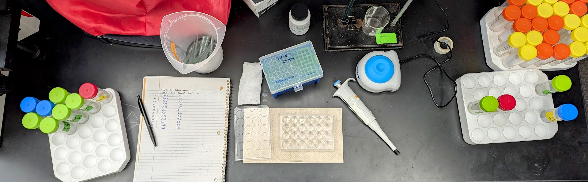

```{r setup, include=FALSE}
knitr::opts_chunk$set(echo = FALSE)
```

```{r banner, echo=FALSE, results='asis'}
cat('<div style="text-align: center;">')

cat('</div>')
```

Logistics is an essential part of experimental design, and as I work towards the main experiments that will test my hypotheses and address my aims, there are many details to work out. First up is a basic problem: I don't have enough rotifers.

The design of the evolution experiments slated for later this summer calls for 40 experimental cultures per 'stock' culture. My current plans for experimental cultures call for a density of 5 rotifers per mL of culture volume. The total culture volume is planned to be 20 mL, meaning I'll need approximately 100 rotifers per experimental culture, and therefore 4,000 total per 'stock' culture.

The very rough estimates of density I've done so far place the carrying capacity of my 20 mL stock cultures at a density of 113 rotifers per mL, which wouldn't be enough for highly-replicated evolution experiments. I need at least double the culture volume, but to be safe, I'm increasing culture volume by 5 times to 100 mL.

```{r, cultureCapacity, echo=FALSE, include=FALSE}
# average count of rotifers in long-term cultures (# individ. / 0.3 mL)
avgCount <- mean(34, 59, 228, 35, 65, 97, 105, 175, 141, 145, 101, 31)

# average count of rotifers per 1 mL
avgDens <- avgCount/0.3
```

To start these new, larger cultures, we first counted the various clonal cultures in storage. This included 16 dedicated stock cultures, and 8 finished experimental cultures from a previous population growth rate experiment. Since the cultures from both of these sources were clonal, I chose to use whichever source had the highest abundance for each clone. This maximized my new cultures' starting density, which is limited by how much volume can be removed from the least-dense culture without using it all up. 

New 100 mL stock cultures were seeded with a consistent density of each clone:

```{r, cultureSeeding, echo=TRUE}
library(tidyverse)
library(car)
library(knitr)

sourceCultures <- data.frame(
  Source = c("Stock", "Stock", "Pop1", "Pop1", "Pop1", "Stock", "Pop1", "Pop1", "Pop1", "Pop1", "Stock", "Stock"),
  CloneID = c("1.1", "1.2", "1.5", "1.6", "1.7", "2.1", "2.2", "2.3", "2.4", "2.5", "2.7", "1.8"),
  Count = c(34, 59, 228, 35, 65, 97, 105, 175, 141, 145, 101, 31))

countVol = 0.3         # volume counted in plate
finalDensity = 10      # rotifers per mL
finalVolume = 100      # stock culture volume, mL

VolumeFinal <- (finalDensity * finalVolume)/ (sourceCultures$Count / countVol)
sourceCultures <- cbind(sourceCultures, VolumeFinal)

# I couldn't find any 10 mL pipette tips, so I included this column to easily use the 5 mL pipette twice
VolFinHalf <- sourceCultures$VolumeFinal / 2
sourceCultures <- cbind(sourceCultures, VolFinHalf)

kable(sourceCultures)
```