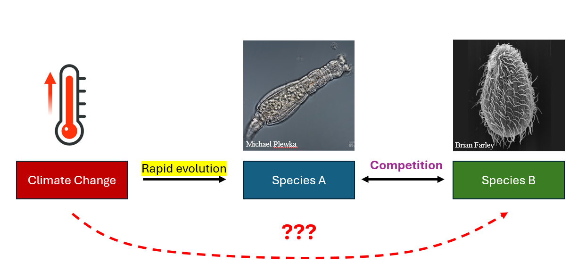

```{r setup, include=FALSE}
knitr::opts_chunk$set(echo = FALSE)

```

In this project, I aim to investigate evolution-mediated indirect effects of increased temperature stress on competitive effect and competitive response. To do so, I'll expose genetically diverse populations of an aquatic invertebrate to stressful and ambient temperatures for many (~50) generations, establishing two different microevolutionary histories of temperature. By exposing subsequent evolved populations to a natural competitor, I hope to observe differences in competitive ability (both effect and response) as mediated by microevolutionary change in population trait frequencies as a response to increased temperature stress. This blog will document each step---the good and the bad---in reaching for this goal over the next year.

```{r, echo=FALSE, results='asis'}
cat('<div style="text-align: center;">')

cat('</div>')
```